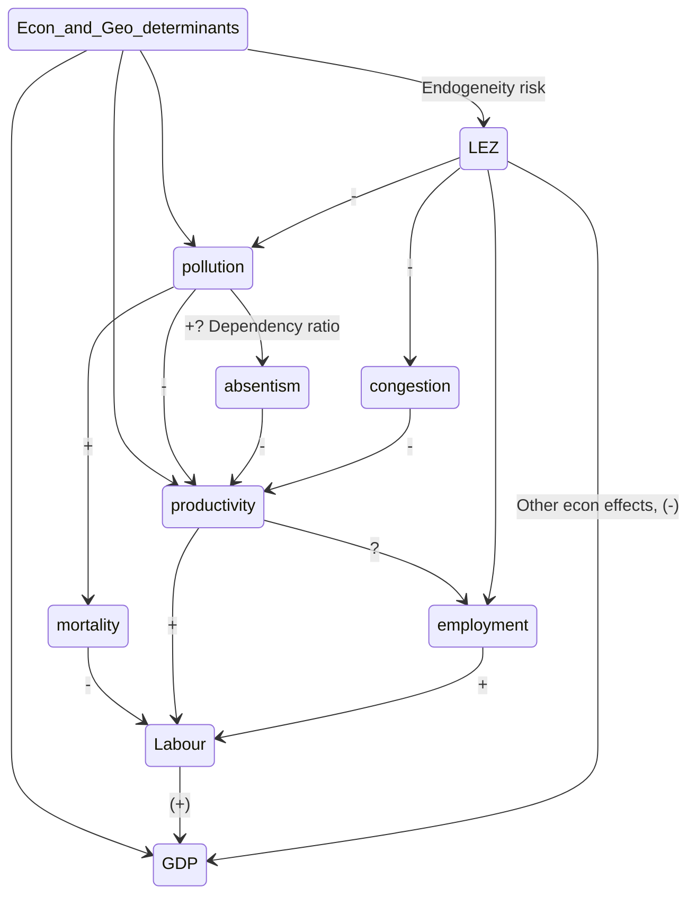

# Meeting with Raúl 04/2020

## Main points:

- [ ] Possibility to increase the sample to all the UK / All Germany / European Union

- [ ] Approach to "exogeneity" of the treatment

- [ ] Rationalization of "transmission mechanisms"

  

## Possibility to increase of sample:

Given I have a decent amount of data regarding the geolocation and characteristics of LEZ and other Urban Access Regulations I thought it is a opportunity to increase the scope of the analysis:

+ ***In the call: See the map and the DB from sources to have a sense of the data I have. Data comes from 2 sources. $\rightarrow$ R (look at the other attached HTML file)***

|                         Subject                         | Pros                                                         | Cons                                                         |
| :-----------------------------------------------------: | ------------------------------------------------------------ | ------------------------------------------------------------ |
|                     **Complexity**                      |                                                              | Higher computational power and more complex code (I need a set of controls for each city) |
| **Compare policies relative effect** (policy relevance) | I can compare between different cities and their implementations of the policies. | Need good (better if detailed) data of implementations       |
|                                                         | I Eliminate the problems of high spillovers between London zones |                                                              |
|                     **Usefulness**                      | Higher external validity and usual standard errors of coefficients. | Better analysis of the London case                           |
|                       **Methods**                       | I can use a wider set of methods, from Diff-in-diff to newer forms of synthetic control methods (matrix completion method, generalized SYNTH) | Hill have to do a bit more research on those.                |

#### Possible increases of sample

|   Sample    | Pros                                                         | Cons                                                         |
| :---------: | ------------------------------------------------------------ | :----------------------------------------------------------- |
| **Germany** | Work of [Morfed et al](https://journals.plos.org/plosone/article?id=10.1371/journal.pone.0102999) and Wolff (2014) on the effect of LEZ in pollution. Work of Gehrsitz (2017) on LEZ effects in pollution and infant health​.:arrow_right:  ​Clear data on implementation and treatment status, Clear methodologies and estimates to compare when doing $TE_{LEZ \rightarrow pollution}$. | More research already done.                                  |
|             | More unified policies as they are guided by national legislation, reducing unobserved variance in treatment | Less "implementation diversity" to compare the relative effects of policies: If all are the same, I can't compare their effects. |
|             | LEZ implemented sooner and in higher numbers. More treated, but probably less controls if they are also restricted. | **Foreign language (webpages / legislations / data sources)** |
|   **UK**    | Known language                                               | LEZ implemented latter (besides London), less information about them. |
|             | Has additional data on Productivity and Household Income.    |                                                              |
|   **EU**    | Known language                                               | Less control over data errors                                |
|             | I can be restricted to some of them whom data I trust because I have more to discard. | More cities to consider and thus more data to collect        |

## Approach to exogeneity of the treatment and SUTVA:

I need both but the solutions of one might compromise the other...

[  ] I really need to check which kind of exogeneity do I need. 

* Exogenous distribution of fixed characteristics -> NO, The synthetic controll will take care of that by constructing a control with "the same" characteristics.
* Only exogenous (or global) shocks in treatment period -> YES, 

#### A suitable comparison group (ex exogeneity):

What would make the treatment endogenous? That treatment and control are significantly different in characteristics that condition the final output.

Possible failures of exogeneity:

* Cities / countries that apply LEZ have more X than those who don't and X affect the short and medium term GDP/productivity/...
  * X: Progressive politics (Eurobaromoeters? [here](https://data.europa.eu/euodp/es/data/dataset/S993_75_2_EBS365) and [here](https://data.europa.eu/euodp/es/data/dataset/S2008_81_3_416) (examples)), [EU member state requests in Env. policy 2004-2009](https://dataverse.harvard.edu/dataset.xhtml?persistentId=doi:10.7910/DVN/FAV82K)
  * X: Other environmentalist measures *(possibly test "balance" of treatment on [this](https://eiuperspectives.economist.com/sites/default/files/European_Green_City_Index.pdf), or [this](https://www.arcadis.com/en/global/our-perspectives/sustainable-cities-index-2016/comparing-cities/?tf=tab-planet&sf=all&r=europe&c=zurich,stockholm,vienna,london,frankfurt,hamburg,prague,munich,amsterdam,geneva,edinburgh,copenhagen,paris,berlin,rotterdam,madrid,rome,barcelona,antwerp,dublin,warsaw,brussels,milan,lisbon,lyon,moscow,athens,istanbul) indexes to see if "greener" cities tend to apply more LEZ and on pre-treatment pollution measures.)*
  * X: Income per capita
  * X: Cyclists/Public transport systems (I have some data on this)
  * X: Less/more proportion of transport-induced pollution

How to have a strong argument of exogeneity?

* Include the X, if possible, in the Synthetic Control estimation and test for their balance.
* To a "Backdating" test, if the Synthetic control accurately predicts the pre-intervention path, it should be credible as a counterfactual.
* Comparing treated areas with control areas that were treated in later periods as Neumark and Kolko (2010) *(They do not use Synth, they do a FE complex linear regression)*
* Argument theoretically:
  * The decision is not really optional, it mainly comes from the obligation to comply with the European Commission regulations in air quality, thus self-selection is less likely.
  * Ask Laura Dyett (TFL) on the variables she took into account when 

How can this be tested?

* Parallel trends assumption
* Balancing of covariates as done by Abadie et al. (2003) (for effects on GDP)

#### SUTVA

SUTVA requires that the response of a particular unit depends only on the treatment to which he himself was assigned, not the treatments of others around him.

* No spillover effects :arrow_right: Change pool of controls to a more restrictive pool that has higher geographic/administrative/economic separation.

Possible spilover effects:

* **Contagion**: A LEZ in a big city makes the fleet of cars change and thus all their neighboring cities will have part of their fleet changed.
* **Displacement**: If a very strong LEZ displaces business to "control" cities, the ATE on GDP, employment, ... would be biased.
* **Signalling**: The first LEZ in Germany sends a strong signal that similar German cities might apply a LEZ soon and thus changes the car fleets of those control cities start to change.
* **Anticipation**: LEZ zones are advertised before application to give some time to change fleet so the effects might be seen before application or the timing of effects might not be perfect.

## Rationalization of transmission mechanisms:

Note: Read more on the mediation literature: (see "Indentify more, observe less" paper)

### How do I shine light on this network of effects?

I have data on: LEZ, Pollution, Employment, "productivity", deaths,  GDP

### 1. Use the same methodology, but step by step (my favourite)

1. Predict the effect of LEZ for each of the transmission mechanisms I have data of:

   $TE_{LEZ \rightarrow pollution}, TE_{LEZ \rightarrow congestion}, ....$ (for each city, maybe for each $t$)

2. Look how the policy effects in productivity, congestion, pollution, ... affect the final effect of the policy in GDP 

   ($TE_{e, t-1} \rightarrow TE_{LEZ, t}, e = pollution, congestion, ...$)

   Something like: $TE_{LEZ, i, t-1} = \beta_0 + \beta_1 TE_{pollution, i, t} + \beta_2 TE_{congestion, i, t} + \beta_3TE_{employment, i, t} + ... + \epsilon$, for each city $i$ and each time $t$ after the intervention.

What would be the controls needed to this last "transmission mechanisms" regression?

* If I want to see how $TE_{LEZ ->pollution}$ affected $TE_{LEZ->GDP}$ I would need to control for all confounders. I would need to include ALL potential confounders included in the estimation of each $TE_{e}$. As the confounder $Z$ would have 

$$
cor(Z, LEZ) \neq 0 \text{ and } cor(Z, e) \neq 0 \text{ so... }
$$

$$
cor(Z, TE_{LEZ\rightarrow e}) \neq 0$ \text{ and } cor(Z, TE_{LEZ\rightarrow GDP}) \neq 0 \\ \text { because } \\ cor(LEZ, TE_{LEZ\rightarrow GDP}) \neq 0
$$

This will summarize the effects on the labour input of GDP, as this is the one who is more probably positively affected by the introduction of a LEZ.

#### Doubts on my method:

* Possible flaws? :arrow_right:
* How  convincing it really is? :arrow_right:

### 2. Simplify the analysis and have "productivity" as the final output:

Possible change of the main $Y$, from $GDP$ to $\frac{GDP}{Emp}$ as a proxy to productivity. I could do both.

* Pros:
  * Less complex transmission mechanisms.
* Cons:
  * Loosing the main discourse of "the effects in the economy" to "the effects in productivity", which is less interesting policy wise.
  

### 3. Use the methodology from "Identify more, observe less"

https://www.mendeley.com/reference-manager/reader/bd6a35f1-a6e2-3993-be0d-3dd26b0b3c0f/60cc649b-ae37-f6ef-2ebc-627890c8076a/

##### Doubts:

* Can I do with different transmission mechanisms? Should they be "one directional"? If not, should I use IV or something?
* Where is a package that does this? Should I write it myself?

## *Only If we have more time...*

### 3. Create a macro model where my assumptions and modelling is clear (just a side idea)

>  NOTE: **I am not sure** how to do this, and leaving my time series and macro notes in London makes it harder.

Model a relation of the form $Y = f(K, L, H|D, A)$ where output $Y$ is a function of capital $K$, labor $L$ and human capital $H$ controlling for demographics $D$ and different applications of the policy $A$, all fixed in the short term. In this specification $K$ and $L$ are functions of the application of the policy and represent the transmission mechanisms.

For example:
$$
\begin{align}
Y_t &= K_t^\alpha L_t^\beta H_t^\gamma,\\
K_t &= \theta_{1}K_{t-1} + \theta_{2}A_P + \theta_{3}t + \theta_{4}A_P*t + D\delta + \epsilon \\
L_t &= \phi_{1}L_{t-1} + \phi_{2}A_P + \phi_{3}t + \phi_{4}A_P*t + D\delta + \omega  \\
H_t &= \xi_{1}H_{t-1} + \xi_{2}A_P + \xi_{3}t + \xi_{4}A_P*t + D\delta  + \upsilon
\end{align}
$$
With $A_P$ being the application of the policy $P$, and $D$ is a matrix of demographic controls. I (think) this might be done by doing some AR(p) model or a VAR(p) for each "transmission mechanism".

## Assumptions of Synth:

+ Non interference between units (Abadie it al 2010, p.494),
+ Only treated units are exposed to the intervention and they are treated uninterruptedly. ("Synth: an R package" PDF p.3) 
  + "No region in the pool of potential donor regions can have a similar policy change."
  + "The policy change has no effect before it is enacted. (M. Urban p.3)"
    + *Could this be "avoided" by not considering the last pre-treatment period to estimate weights?*
+ "Ideally,  we  would  like  to  construct  a  synthetic  control  that  resembles  the  treated  unit  in all relevant (predictors of outcome) pre-intervention characteristics." ("Synth: an R package" PDF p.3)
  + The set of covariates is usually restricted to variables that are measured before the intervention occurs, but the user could include post-intervention characteristics as long as they are unaffected by the intervention. 
  + Linear combinations  of  pre-intervention  outcomes  can  be  used  to  control  for  unobserved common factors whose effects vary over time.
    + See Abadie et al. (2010)  and "Synth: an R package" for details.
+ "The values of those variables for the policy region cannot be outside any linear combination of the values for the donor pool. " ("In the convex hull") (Manual Urban)
+ "Finally, those variables and the outcome must have an approximate linear relationship." (Manual Urban p.)

### Tricks / Steps to apply Synth:

STEP 0: 

Find data on predictors and outcomes that has sufficient pre-intervention and post-intervention information.

* Pre Intervention: "The credibility of a synthetic control estimator depends in great part on its ability to steadily track the trajectory of the outcome variable for the affected unit before the intervention." **AB 2019 p27**
  * Abadie,  Diamond,  and Hainmueller(2010)  show  that  if  the  data  generating  process  follows  a  factor  model,  then  the  bias  of  the synthetic control estimator is bounded by a function that is inversely proportional to the number of pre-intervention periods during which the synthetic control closely tracks the trajectory of the outcome variable for the affected unit. 
    * The severity of this problem can be diminished if powerful predictors of post-intervention values of $Y^N_{jt}$, (counterfactual) aside from pre-intervention values of the outcome, are included in $X_j$, reducing the residual variance and, as a result, the risk of overfitting.

Identify an outcome variable that has a sizable effect and limited volatility (and a close time horizon).

* "The nature of this exercise, which focuses on a single treated unit or on a small number of treated units, indicates that small effects will be indistinguishable from other shocks to the outcome of the affected unit, especially if the outcome variable of interest is highly volatile" **(Abadie, 2019)**
  * High volatility elevates the risk of volatility **(Abadie 2019, p. 22)**
  * This can be reduced by averaging and by "filtering both the treated and control units" before Synth.
    * For example, Amjad et al. (2018) propose singular value thresholding to de-noise data for Synth. (Abadie, 2019)
* *Time horizon.* The effect of some interventions may take time to emerge or to be of sufficient magnitude to be quantitatively detected in the data. We would need to wait to get more data or use surrogate outcomes or leading indicators. **AB2019 p.26**

STEP 1:  Identify predictors of the outcome variable. Ideally, those predictors have a stable relationship with the outcome variable.

* Include time variant variables only in some dates and not for the whole period as Abadie et al (2003), and highly encouraged by [paper on this, Kaul and coauthors (2016)](https://ideas.repec.org/p/pra/mprapa/83790.html).
  * Athey and Imbens (2006) even state that including the other covariates rarely matter.
  * Kaul and coauthors (2016) also point out that if the other predictors help predict the outcome, omitting them can bias the synthetic regions’ outcome in the posttreatment period. They suggest using either an average of the outcome across all pretreatment years or the last year of the pretreatment period. 
  * Ferman, Pinto, and Possebom (2016) recommend that analysts try several different sets of lags and report the results from all of them. 
* "Hahn and Shi (2016) state that studies should have a relatively large number of predictors compared to the number of donor states." (M. Urban p.5)
* **HOW should I test predictors? some should be lagged?**

STEP 2: Identify the potential donor states that will synthesize the control state.

* Because the control state is a contrast to the treated state after treatment, similar policies should not be enacted in any donor pool state in any year during the study. (M. Urban p.5-6 & Abadie (2019))
  * See what would have been the effect if they are included (should be a smaller treatment effect)
* "Eliminate from the donor pool any unit that may have suffered large idiosyncratic shocks to the outcome of interest during the study period,  if it is judged that such shocks would not have affected the outcome of the unit of interest in the absence of the intervention" (Abadie, 2019)
* Moreover, it is important to restrict the donor pool to units with characteristics that are similar to the affected unit. (Abadie, 2019) This is to restrict for interpolation biases ad avoid that large discrepancies are averaged. (as done for matching)
  * The relationship between the predictors and the outcome variable in the donor pool states must be similar to that relationship in the treated state.  (M. Urban)
  * Abadie, Diamond, and Hainmueller (2015) also declare that the outcomes of the states in the donor pool should be driven by the same process as that found in the treated state before treatment.
    * *(Like, only take European or High-income countries/cities or urban/rural areas)* 
  * "Related to this point, Abadie and L’Hour (2019) propose adding to the objective function in equation (6) a set of penalty terms that depend on the discrepancies between the characteristics of the affected unit and the characteristics of the individual units included in the synthetic control (see Section 8 for details)" (Abadie, 2019)
* Enlarging the pool by including states with idiosyncratic variation in predictors runs the risk of overfitting. (M. Urban p.6) 
  * We can avoid this by different CV. procedeures. Abadie et al (2015) give some tools. Errors are pointed out  Klößner and coauthors (2016) (and ___?)
  * **What does this means?**
* *No interference:* If spillover effects are substantial and affect units in close geographical proximity, those units may provide a biased estimate of the counterfactual outcome without intervention for the unit affected by the intervention. **AB2019 p.23** We have to exclude them.
* *Convex hull condition:* Synthetic control estimates are predicated on the idea that a combination of unaffected units can approximate the pre-intervention characteristics of the affected unit. If  the  unit  affected  by  the intervention of interest is “extreme” in the value of a particular variable, such a value may not be closely approximated by a synthetic control **AB2019 p.25** We have to prove this holds.
  * If we have that the outcome variable is "extreme" we can proceed looking at differences $\Delta Y_{it}$, growth rates, or difference to pre-intervention means. (see the effect of this in noise in **AB2019 p25**)

STEP 3: Choose a method for selecting predictor weights (How to reduce overfitting)

+ The optimal weights will minimize the synthetic’s mean squared prediction error.
+ The cross-validation method shows promise, but currently the standard method is the safer choice.

STEP 4: Assess the pretreatment period goodness of fit of the synthetic control state (generated using the Synth package).

* "Synthetic control estimators may be biased if forward looking economic  agents react in advance of the policy intervention" **AB2019 p.23**
  * If there are signs of anticipation, it is advisable to backdate the intervention in the data set to a period before any anticipation effect can be expected, so the full  extent of  the effect of  the intervention can  be estimated.  
  * Notice that backdating  the intervention in the data does not mechanically bias the estimator of the effect of the intervention even if some periods before the intervention are mistakenly recorded as post-intervention periods.
* Evaluate how closely the outcome path of synthetic control during the pretreatment period follows that of the treated state based on appearance and the root mean squared prediction error.
* If the fit appears poor, use a model with all possible outcome lags as a test. If the synthetic control state under this model poorly matches the treated state, the synthetic control method should not be used because no model will yield a good fit. But recognize that using all possible lags in the final model can bias the outcome path of Synth..
* Review state weights to judge similarities between the donor states and the treated state. It can be more important for outcomes of donor states to have a trend similar to that of the treated state than for the states to have a similar average.
* Review predictor weights to determine the selected predictor variables’ strength in explaining the outcome. (*And look at STEP 0 and how good predictors might help*)

Step 5: Conduct placebo test on states in the donor pool to evaluate the significance of the results for the treated state.

* If the post-treatment difference between the treated state and its synthetic is larger than the difference for most of the placebo states, there is evidence that the treatment had an effect. **MU**
  * Review this, not sure if correct or "abandoned"...
* *Backdating:* As we saw this can help to find anticipation effects, if there is some effect of the intervention it should show. If we see that Synth accurately follows the real path of the Treated Unit we can have confidence in it **AB2019, p 28**
* Evidence of significance should be treated as suggestive of an effect rather than as a rejection of a null hypothesis.

Step 6: Conduct sensitivity (robustness) analyses to further test the credibility of the results. Two design decisions can influence results: The choice of the donor pool and the choice of predictors to the outcome variable.

* *Donor pool:*
  * LOO re-analysis looking if the exclusion of a given control strongly affects the estimates.
    * "If the exclusion of a unit from the donor pool has a large effect on results without a discernible change in pre-intervention fit, this may warrant investigating if the change in the magnitude of the estimate is caused by the effects ofother interventions or by particularly large idiosyncratic shocks on the outcome of the excluded control unit" (**AB2019, p29**)
  * Make "rings of influence" around cities to avoid the effects of spillovers.
* *Predictors:*
  * CV procedures
  * Look sensibility with LOO or reducing the number of predictors

Further notes / Extensions:

* Multiple treated units: **TO FILL AB2019**
  * With multiple treated units it is more possible that $X_1$ (The characteristics of the treated) lies in the convex hull of $X_0$ (the characteristics of the controls) and possibly that there are infinite solutions for possible weights of controls ($W^*$), some that might involve high interpolation biases. To control for this  Abadie  and  L’Hour  (2019)  propose  a  synthetic  control  estimator that incorporates a penalty for pairwise matching discrepancies between the treated units and their chosen synthetic controls. (Explained in **AB2019, p33**)
* What if we are trying to include cities that have large pairwise discrepancies with those in the control set (like London)?
  * Abadie  and  L’Hour  (2019)  and  Ben-Michael  et  al.(2019) propose  modifications  of  the  synthetic  control  estimator  along  the  lines  of  the  bias-correction techniques of Rubin (1973), Quade (1982), and Abadie and Imbens (2011). 
* How to do inference with multiple treated units?
  * Show TE a given unit treated with respect to the TE of their synthetic controls (ME)
  * Abadie  and  L’Hour  (2019)  and  Ben-Michael  et  al.  (2019)propose  modifications  of  the  synthetic  control  estimator  along  the  lines  of  the  bias-correction techniques of Rubin (1973), Quade (1982), and Abadie and Imbens (2011).  (More in **AB2019 p 34**)
  * Hainmueller (2012) and Robbins et al. (2017) consider aggregating both treatment and controls to estimate only one Synth with only one treatment, as usual.
* Allowing  extrapolation:
  * Doudchenko and Imbens (2016) consider weights that may be negativeand  may  not  sum  to  one,  and  allow  for  a  constant  shift  in  the  level  of  the  synthetic  control estimator (relative to a linear combination of outcomes in the control group).  For this model, they propose an estimator that fits the pre-treatment outcomes for the treated using an elastic net  to  regularize  the  weights.   Their  estimators  are  also  related  to  the  panel  data  approach to program evaluation estimator in Hsiao et al. (2012).  Arkhangelsky et al. (2019) expand on the  methods  in  Doudchenko  and  Imbens  (2016)  by  introducing  a  synthetic  control  estimator that weights not only the units in the control group but also pre-intervention time periods to approximate the counterfactual of interest. 
* Matrix  completion/estimation  methods.
  * Amjad  et  al.  (2018,  2019)  and  Athey  et  al.  (2018) propose  related  methods  that  use  tools  from  the  matrix  completion/matrix  estimation  literature.  (more in **AB2019 p35**)

Related methods:

**MU** :arrow_right: The Synthetic Control Method as a Tool to Understand State Policy. End reading? :x:

**A2019** :arrow_right: "Using synthetic controls: Feasibility, Data requirements and Methodological aspects". End reading? :x: