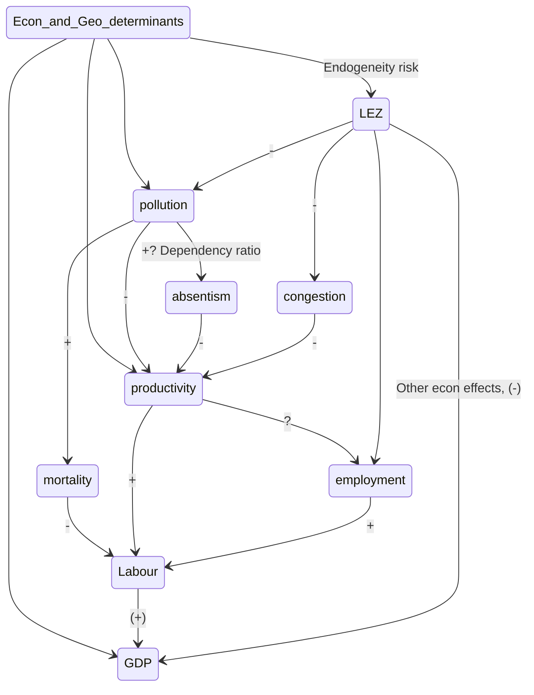

# Meeting with Raúl 04/2020

## Main points:

- [ ] Possibility to increase the sample to all the UK / All Germany / European Union

- [ ] Approach to "exogeneity" of the treatment

- [ ] Rationalization of "transmission mechanisms"

  

## Possibility to increase of sample:

Given I have a decent amount of data regarding the geolocation and characteristics of LEZ and other Urban Access Regulations I thought it is a opportunity to increase the scope of the analysis:

+ ***In the call: See the map and the DB from sources to have a sense of the data I have. Data comes from 2 sources. $\rightarrow$ R (look at the other attached HTML file)***

|                         Subject                         | Pros                                                         | Cons                                                         |
| :-----------------------------------------------------: | ------------------------------------------------------------ | ------------------------------------------------------------ |
|                     **Complexity**                      |                                                              | Higher computational power and more complex code (I need a set of controls for each city) |
| **Compare policies relative effect** (policy relevance) | I can compare between different cities and their implementations of the policies. | Need good (better if detailed) data of implementations       |
|                                                         | I Eliminate the problems of high spillovers between London zones |                                                              |
|                     **Usefulness**                      | Higher external validity and usual standard errors of coefficients. | Better analysis of the London case                           |
|                       **Methods**                       | I can use a wider set of methods, from Diff-in-diff to newer forms of synthetic control methods (matrix completion method, generalized SYNTH) | Hill have to do a bit more research on those.                |

#### Possible increases of sample

|   Sample    | Pros                                                         | Cons                                                         |
| :---------: | ------------------------------------------------------------ | :----------------------------------------------------------- |
| **Germany** | Work of [Morfed et al](https://journals.plos.org/plosone/article?id=10.1371/journal.pone.0102999) and Wolff (2014) on the effect of LEZ in pollution. Work of Gehrsitz (2017) on LEZ effects in pollution and infant health​.:arrow_right:  ​Clear data on implementation and treatment status, Clear methodologies and estimates to compare when doing $TE_{LEZ \rightarrow pollution}$. | More research already done.                                  |
|             | More unified policies as they are guided by national legislation, reducing unobserved variance in treatment | Less "implementation diversity" to compare the relative effects of policies: If all are the same, I can't compare their effects. |
|             | LEZ implemented sooner and in higher numbers. More treated, but probably less controls if they are also restricted. | **Foreign language (webpages / legislations / data sources)** |
|   **UK**    | Known language                                               | LEZ implemented latter (besides London), less information about them. |
|             | Has additional data on Productivity and Household Income.    |                                                              |
|   **EU**    | Known language                                               | Less control over data errors                                |
|             | I can be restricted to some of them whom data I trust because I have more to discard. | More cities to consider and thus more data to collect        |

## Approach to exogeneity of the treatment and SUTVA:

I need both but the solutions of one might compromise the other...

[  ] I really need to check which kind of exogeneity do I need. (Exogenous treatment of characteristics, only exogenous (or global) shocks in treatment period... )

#### Exogeneity:

What would make the treatment endogenous? That treatment and control are significantly different in characteristics that condition the final output.

Possible failures of exogeneity:

* Cities / countries that apply LEZ have more X than those who don't and X affect the short and medium term GDP/productivity/...
  * X: Progressive politics
  * X: Other environmentalist measures *(possibly test "balance" of treatment on [this](https://eiuperspectives.economist.com/sites/default/files/European_Green_City_Index.pdf), or [this](https://www.arcadis.com/en/global/our-perspectives/sustainable-cities-index-2016/comparing-cities/?tf=tab-planet&sf=all&r=europe&c=zurich,stockholm,vienna,london,frankfurt,hamburg,prague,munich,amsterdam,geneva,edinburgh,copenhagen,paris,berlin,rotterdam,madrid,rome,barcelona,antwerp,dublin,warsaw,brussels,milan,lisbon,lyon,moscow,athens,istanbul) indexes to see if "greener" cities tend to apply more LEZ and on pre-treatment pollution measures.)*
  * X: Income per capita
  * X: Cyclists/Public transport systems (I have some data on this)
  * X: Less/more proportion of transport-induced pollution

How to have a strong argument of exogeneity?

* Include the X, if possible, in the Synthetic Control estimation and test for their balance.
* Comparing treated areas with control areas that were treated in later periods as Neumark and Kolko (2010)
* Argument theoretically:
  * The decision is not really optional, it mainly comes from the obligation to comply with the European Commission regulations in air quality, thus self-selection is less likely.
  * Ask Laura Dyett (TFL) on the variables she took into account when 

How can this be tested?

* Parallel trends assumption
* Balancing of covariates as done by Abadie et al. (2003) (for effects on GDP)

#### SUTVA

SUTVA requires that the response of a particular unit depends only on the treatment to which he himself was assigned, not the treatments of others around him.

* No spillover effects :arrow_right: Change pool of controls to a more restrictive pool that has higher geographic/administrative/economic separation.

Possible spilover effects:

* **Contagion**: A LEZ in a big city makes the fleet of cars change and thus all their neighboring cities will have part of their fleet changed.
* **Displacement**: If a very strong LEZ displaces business to "control" cities, the ATE on GDP, employment, ... would be biased.
* **Signalling**: The first LEZ in Germany sends a strong signal that similar German cities might apply a LEZ soon and thus changes the car fleets of those control cities start to change.
* **Anticipation**: LEZ zones are advertised before application to give some time to change fleet so the effects might be seen before application or the timing of effects might not be perfect.

## Rationalization of transmission mechanisms:

Note: Read more on the mediation literature: (see "Indentify more, observe less" paper)

### How do I shine light on this network of effects?

I have data on: LEZ, Pollution, Employment, "productivity", deaths,  GDP

### 1. Use the same methodology, but step by step (my favourite)

1. Predict the effect of LEZ for each of the transmission mechanisms I have data of:

   $TE_{LEZ \rightarrow pollution}, TE_{LEZ \rightarrow congestion}, ....$ (for each city, maybe for each $t$)

2. Look how the policy effects in productivity, congestion, pollution, ... affect the final effect of the policy in GDP 

   ($TE_{e, t-1} \rightarrow TE_{LEZ, t}, e = pollution, congestion, ...$)

   Something like: $TE_{LEZ, i, t-1} = \beta_0 + \beta_1 TE_{pollution, i, t} + \beta_2 TE_{congestion, i, t} + \beta_3TE_{employment, i, t} + ... + \epsilon$, for each city $i$ and each time $t$ after the intervention.

What would be the controls needed to this last "transmission mechanisms" regression?

* If I want to see how $TE_{LEZ ->pollution}$ affected $TE_{LEZ->GDP}$ I would need to control for all confounders. I would need to include ALL potential confounders included in the estimation of each $TE_{e}$. As the confounder $Z$ would have 

$$
cor(Z, LEZ) \neq 0 \text{ and } cor(Z, e) \neq 0 \text{ so... }
$$

$$
cor(Z, TE_{LEZ\rightarrow e}) \neq 0$ \text{ and } cor(Z, TE_{LEZ\rightarrow GDP}) \neq 0 \\ \text { because } \\ cor(LEZ, TE_{LEZ\rightarrow GDP}) \neq 0
$$

This will summarize the effects on the labour input of GDP, as this is the one who is more probably positively affected by the introduction of a LEZ.

#### Doubts on my method:

* Possible flaws? :arrow_right:
* How  convincing it really is? :arrow_right:

### 2. Simplify the analysis and have "productivity" as the final output:

Possible change of the main $Y$, from $GDP$ to $\frac{GDP}{Emp}$ as a proxy to productivity. I could do both.

* Pros:
  * Less complex transmission mechanisms.
* Cons:
  * Loosing the main discourse of "the effects in the economy" to "the effects in productivity", which is less interesting policy wise.
  

### 3. Use the methodology from "Identify more, observe less"

https://www.mendeley.com/reference-manager/reader/bd6a35f1-a6e2-3993-be0d-3dd26b0b3c0f/60cc649b-ae37-f6ef-2ebc-627890c8076a/

##### Doubts:

* Can I do with different transmission mechanisms? Should they be "one directional"? If not, should I use IV or something?
* Where is a package that does this? Should I write it myself?

## *Only If we have more time...*

### 3. Create a macro model where my assumptions and modelling is clear (just a side idea)

>  NOTE: **I am not sure** how to do this, and leaving my time series and macro notes in London makes it harder.

Model a relation of the form $Y = f(K, L, H|D, A)$ where output $Y$ is a function of capital $K$, labor $L$ and human capital $H$ controlling for demographics $D$ and different applications of the policy $A$, all fixed in the short term. In this specification $K$ and $L$ are functions of the application of the policy and represent the transmission mechanisms.

For example:
$$
\begin{align}
Y_t &= K_t^\alpha L_t^\beta H_t^\gamma,\\
K_t &= \theta_{1}K_{t-1} + \theta_{2}A_P + \theta_{3}t + \theta_{4}A_P*t + D\delta + \epsilon \\
L_t &= \phi_{1}L_{t-1} + \phi_{2}A_P + \phi_{3}t + \phi_{4}A_P*t + D\delta + \omega  \\
H_t &= \xi_{1}H_{t-1} + \xi_{2}A_P + \xi_{3}t + \xi_{4}A_P*t + D\delta  + \upsilon
\end{align}
$$
With $A_P$ being the application of the policy $P$, and $D$ is a matrix of demographic controls. I (think) this might be done by doing some AR(p) model or a VAR(p) for each "transmission mechanism".

