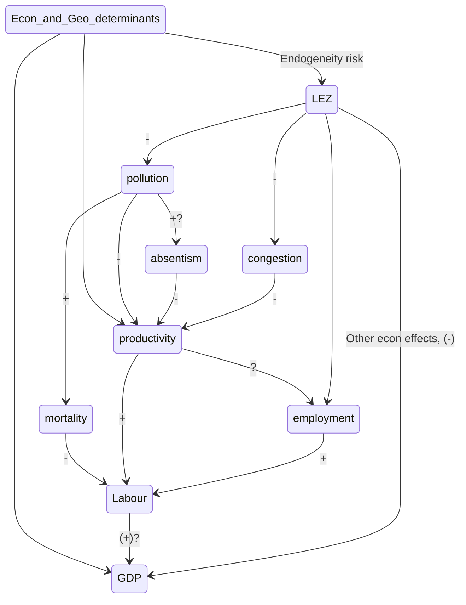

# Meeting - Raúl 01/2020

## Main points:

- [ ] Possibility to increase the sample to all the UK / All germany / European Union

- [ ] Approach to "exogeneity" of the treatment

- [ ] Rationalization of "transmission mechanisms"

  

## Possibility to increase of sample:

Given I have a decent amount of data regarding the geolocation and characterístics of LEZ and other Urban Access Regulations I thought it is a oportunity to increase the scope of the analysis:

+ See the map and the DB from sources $\rightarrow$ R

|                   Subject                   | Pros                                                         | Cons                                                         |
| :-----------------------------------------: | ------------------------------------------------------------ | ------------------------------------------------------------ |
|               **Complexity**                |                                                              | Higher computational power and more complex code (I need a set of controls for each city) |
| **Comparative Politics** (policy relevance) | I can compare between different cities and their implementations of the policies. | Need good (better if detailed) data of implementations       |
|                                             | I do not have the problems of high endogeneity between London zones |                                                              |
|               **Usefullness**               | Higher external validity and usual standard errors of coefficients. | Better analysis of the London case                           |
|                 **Methods**                 | I can use a wider set of methods, from Diff-in-diff to newer forms of synthetic control methods. | Hill have to do a bit more research on those.                |

## Approach to exogeneity of the treatment and SUTVA:

I need both but the solutions of one might compromise the other...

#### Exogeneity:

What would make the treatment endogenous? That treatment and control are significantly different in characteristics that condition the final output.

Possible failures of exogeneity:

* Cities / countries that apply LEZ have more X than those who don't and X affect the short and medium term GDP/productivity/...
  * X: Progressive politics
  * X: Production per capita
  * X: Cyclists/Public transport systems
  * X: Less/more proportion of transport-induced pollution

How to have a strong argument of exogeneity?

* Include the X, if possible, in the Synthetic Control estimation and test for their balance.
* Comparing treated areas with control areas that were treated in later periods as Neumark and Kolko (2010)
* Argument theoretically:
  * The decition is not really optional, it mainly comes from the oblication to comply with the European Comissio regulations in air quality, thus self-selection is less likely.

How can this be tested?

* Parallel trends assumption
* Ballancing of covariates as done by Abadie et al. (2003) (for effects on GDP)

#### SUTVA

SUTVA requires that the response of a particular unit depends only on the treatment to which he himself was assigned, not the treatments of others around him.

* No spillover effects $\rightarrow$ Change pool of controls to a more restrictive pool that has higher geographic/administrative/economic separation.

Possible spillover effects:

* Contagion: A LEZ in a big city makes the fleet of cars change and thus all their neighbouring cities will have part of their fleet changed.
* Displacement: If a very strong LEZ displaces busineses to "control" cities, the ATE on GDP, employment, ... would be biased.
* Signaling: The first LEZ in germany sends a strong signal that similar german cities might apply a LEZ soon and thus changes the car fleets of those control cities start to change.
* Anticipation: LEZ zones are advertised before application to give some time to change fleet so the effects might be seen before application or the timing of effects might not be perfect.

## Rationalization of transmission mechanisms:

### How do I shine light on this network of effects?

### 1. Use the same methodology, but step by step (my favorite)

1. Predict the effect of LEZ in each of them (LEZ $\rightarrow$ pollution, congestion, employment, gdp, productivity ... ) $ATE_{pollution}, ATE_{congestion}, ....$

2. Look how the policy effects in productivity, congestion, pollution, ... affect the final effect of the policy in GDP ($ATE_{i} \rightarrow ATE_{LEZ}, i = pollution, congestion, ...$)

   

   Something like: $ATE_{LEZ} = \beta_0 + \beta_1 ATE_{pollution} + \beta_2 ATE_{congestion} + \beta_3ATE_{employment} + ... + \epsilon$

This will summarise the effects on the labour imput of GDP, as this is the one who is more probably positively affected by the introduction of a LEZ.

### 2. Simplify the analysis and have "productivity" as the final output:

Posible change of the main $Y$, from $GDP$ to $\frac{GDP}{Emp}$ as a proxy to productivity. I could do both.

* Pros:
  * Less complex transmission mechanisms.
* Cons:
  * Loosing the main discourse of "the effects in the economy" to "the effects in productivity", which is less interesting policy wise

## *If we have more time...*

### 3. Create a macro model where my assumptions and modelling is clear (just a side idea)

>  NOTE: **I am not sure** how to do this, and leaving my time series and macro notes in London makes it harder.

Model a relation of the form $Y = f(K, L, H|D, A)$ where output $Y$ is a function of capital $K$, labour $L$ and human capital $H$ controlling for demographics $D$ and different applications of the policy $A$, all fixed in the short term. In this specification $K$ and $L$ are functions of the application of the policy and represent the transmission mechanisms.

For example:
$$
\begin{align}
Y_t &= K_t^\alpha L_t^\beta H_t^\gamma,\\
K_t &= \theta_{1}K_{t-1} + \theta_{2}A_P + \theta_{3}t + \theta_{4}A_P*t + D\delta + \epsilon \\
L_t &= \phi_{1}L_{t-1} + \phi_{2}A_P + \phi_{3}t + \phi_{4}A_P*t + D\delta + \omega  \\
H_t &= \xi_{1}H_{t-1} + \xi_{2}A_P + \xi_{3}t + \xi_{4}A_P*t + D\delta  + \upsilon
\end{align}
$$
With $A_P$ is the application of the policy $P$, and $D$ and is a matrix of demografic controls. I (think) this might be done by doing some AR(p) model or a VAR(p) for each "transmission mechanism".

